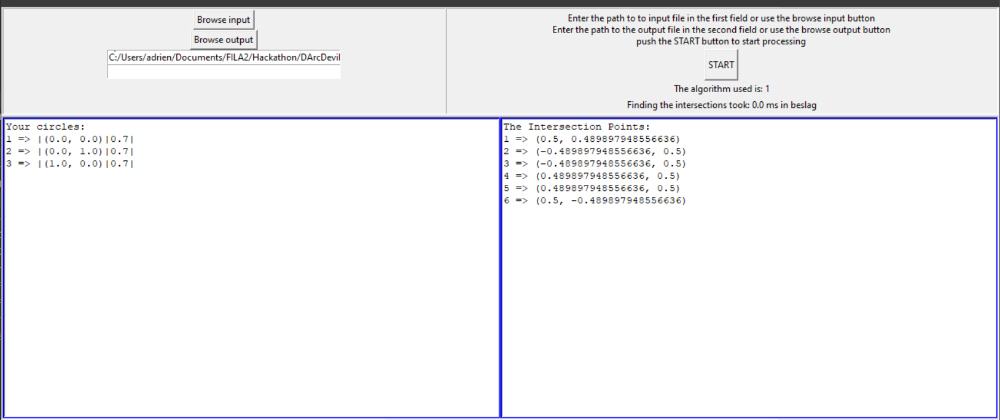

# Hackathon-Impact-triangulation

Algorithm developed in the framework of a Hackathon for the positioning of arrows impact on target by triangulation (calculate the intersections between circles and parabolas).

## Set up the app

### Create a virtual environment#

To create a virtual environment, use the following command, where ".venv" is the name of the environment folder:

```
# macOS/Linux
# You may need to run sudo apt-get install python3-venv first
python3 -m venv .venv

# Windows
# You can also use py -3 -m venv .venv
python -m venv .venv
```

### Load a virtual environment

```
# macOS/LInux
source .venv/bin/activate
# Windows
.venv\scripts\activate
```

### Install package in a virtual environment

Example with matplotlib

```
# Don't use with Anaconda distributions because they include matplotlib already.

# macOS
python3 -m pip install matplotlib

# Windows (may require elevation)
python -m pip install matplotlib

# Linux (Debian)
apt-get install python3-tk
python3 -m pip install matplotlib
```

#### Package to download

```
pip install -r requirements.txt
```

### Use the app

#### Launching the app

```
python main.py
```

#### Selecting a file

For example select the following test file : `TestFiles\testfile1.txt`

Coordinate should be lower than 1.

```
1                                           # -> type of algorithme used
2                                           # -> number of circles
0.673858901432946 0.301141098567054 0.2     # -> positionX positionY radius
0.401141098567053 0.573858901432946 0.3
```

#### Expected results

##### Primary window



##### Graphic window


